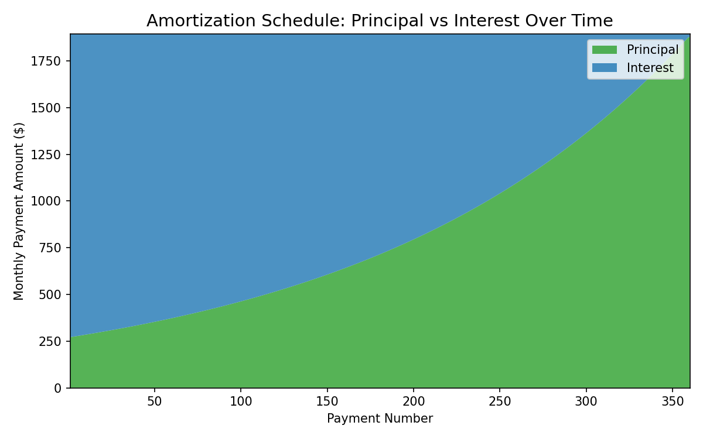

<p align="center">
  
</p>

# mortgagemath

[](https://github.com/murraystokely/mortgagemath/actions/workflows/tests.yml)
<!-- [](https://github.com/murraystokely/mortgagemath/actions/workflows/lint.yml) -->
[](https://raw.githubusercontent.com/murraystokely/mortgagemath/main/coverage.svg)
[](https://pypi.org/project/mortgagemath/)
[](https://opensource.org/licenses/MIT)
[](https://pepy.tech/projects/mortgagemath)
[](https://mortgagemath.readthedocs.io/)

**Cent-accurate mortgage amortization for Python.** Every payment,
interest charge, and balance is computed with `Decimal` arithmetic
and validated against 50 published worked examples from government
regulators, bank servicing guides, and academic textbooks across
six countries. Zero runtime dependencies.

<p align="center">
  ⭐ If <code>mortgagemath</code> helps your work, please
  <a href="https://github.com/murraystokely/mortgagemath">star the project on GitHub</a>.
</p>

## Why mortgagemath?

Most mortgage libraries get the monthly payment right but diverge
from real lender statements by 1–4 cents per row. That drift
compounds over the schedule, breaks reconciliation against actual
bank statements, and makes audit work painful. `mortgagemath` is
built around the rounding and accounting conventions that actual
lenders use:

- **Decimal arithmetic** end-to-end (no float drift)
- **Configurable rounding** — `ROUND_UP`, `ROUND_DOWN`,
  `ROUND_HALF_UP`, `ROUND_HALF_EVEN`
- **Two balance-tracking modes** — `ROUND_EACH` (US lender
  statements) and `CARRY_PRECISION` (Excel / CRE textbooks)
- **Both day-count conventions** — 30/360 and Actual/360
- **International compounding** — monthly (US), semi-annual
  (Canadian *Interest Act* j₂), and effective-annual
- **Flexible payment frequency** — monthly, bi-weekly, weekly,
  quarterly, semi-monthly, semi-annual, or annual
- **Two amortization methods** — level-payment *French* and
  constant-principal *ammortamento italiano*
- **Adjustable-rate mortgages** with rate schedules, payment
  caps, and negative amortization
- **Interest-only periods** with automatic recast
- **Flat per-period fees** for French *assurance emprunteur*
  and similar insurance loadings
- **Currency unit precision** — `Decimal("0.01")` for cents
  or `Decimal("1")` for yen/won
- **Exact zero ending balance** — the final row trues up so
  the schedule lands at exactly zero
- **50 validated fixtures** from the US, Canada, France, Japan,
  Italy, and South Korea

## Installation

```sh
pip install mortgagemath
```

Requires Python 3.11+. Zero runtime dependencies.

```sh
python -m mortgagemath   # self-check against reference values
```

## Quick example

A standard 30-year fixed-rate mortgage from the command line:

```sh
mortgagemath summary --principal 300000 --rate 6.5 --term-months 360
```

Or generate the full payment-by-payment schedule:

```sh
mortgagemath schedule --principal 300000 --rate 6.5 --term-months 360
```

The same loan from Python:

```python
from mortgagemath import us_30_year_fixed, periodic_payment, amortization_schedule

loan = us_30_year_fixed("300000", "6.5")

print(periodic_payment(loan))         # Decimal("1896.21")
sched = amortization_schedule(loan)
print(sched[1].interest)              # Decimal("1625.00")  — payment #1
print(sched[1].principal)             # Decimal("271.21")
print(sched[-1].balance)              # Decimal("0.00")     — exact zero
print(sched[-1].total_interest)       # Decimal("382628.90") — lifetime interest
```

The schedule is a plain `list` — `sched[0]` is the initial balance
(no payment), `sched[1]` through `sched[360]` are the monthly
payments.

For a quick summary without iterating the schedule:

```python
from mortgagemath import us_30_year_fixed, loan_summary

s = loan_summary(us_30_year_fixed("300000", "6.5"))
print(s.periodic_payment)             # Decimal("1896.21")
print(s.total_interest)               # Decimal("382628.90")
print(s.total_paid)                   # Decimal("682628.90")
print(s.num_payments)                 # 360
```

Convenience constructors like `us_30_year_fixed`, `us_15_year_fixed`,
`canada_fixed_j2`, `canada_accelerated_biweekly`, and
`us_actual_360_commercial` handle common cases. The full
`LoanParams` dataclass is available when you need every parameter
explicitly:

```python
from decimal import Decimal
from mortgagemath import LoanParams, PaymentRounding, amortization_schedule

loan = LoanParams(
    principal=Decimal("162000"),
    annual_rate=Decimal("3.875"),
    term_months=360,
    payment_rounding=PaymentRounding.ROUND_HALF_UP,
    interest_rounding=PaymentRounding.ROUND_HALF_UP,
)
sched = amortization_schedule(loan)
print(sched[1].payment)             # Decimal("761.78")
```

For Canadian j₂ mortgages, ARMs with rate and payment caps,
commercial Actual/360 with balloon, interest-only periods,
fee-loaded French schedules, and Japanese yen-precision loans,
see the **[Worked examples](docs/vignettes/rendered/examples.pdf)**
vignette.

## Pandas and Matplotlib integration

`mortgagemath` returns pure Python dataclasses, so converting to a
`pandas.DataFrame` for analysis or plotting is one line:

<p align="center">
  
</p>

```python
import pandas as pd
from mortgagemath import us_30_year_fixed, amortization_schedule

loan = us_30_year_fixed("300000", "6.5")
df = pd.DataFrame(amortization_schedule(loan))
```

See the **[Pandas and Data Visualization](docs/vignettes/rendered/pandas.pdf)** vignette for plotting examples and scenario analysis.

## What's validated

50 published amortization tables exercised by a test suite of more
than 400 tests that runs on every push and release. Every committed
fixture cell reproduces its source value to the cent (or yen). The
sources span six countries and a wide range of loan structures:

- **US regulatory** — CFPB sample disclosures, Reg Z Appendix H
  ARM with 15 years of historical rate adjustments, FHLBB 1935
  direct-reduction plan
- **US commercial** — Fannie Mae Multifamily Actual/360 with
  balloon, Geltner CRE carry-precision
- **US textbooks** — OpenStax, Goldstein, Skinner (1913), Arcones
  SOA Exam FM, Las Positas, Mississippi State Extension
- **Canada** — Olivier and eCampus Ontario semi-annual j₂
  mortgages (monthly and quarterly), RBC accelerated bi-weekly
- **France** — MoneyVox *tableau d'amortissement* with *assurance
  emprunteur* fee loading
- **Japan** — JHF Flat 35 and LoanKeisan full 360-row schedule
  with yen-precision truncation rounding
- **Italy** — Solution Bank and BCC Brescia regulatory
  transparency documents, plus four *ammortamento italiano*
  constant-principal schedules (Università di Cagliari,
  Younited, telemutuo.it, Andrea il Matematico)
- **South Korea** — Tistory worked mortgage with won-precision
- **Reference works** — TI BA II Plus official guidebook,
  Wikipedia mortgage calculator
- **Synthetic** — half-cent rounding boundaries, zero-interest
  edge case

See the **[Validation vignette](docs/vignettes/rendered/validation.pdf)**
for the full 50-fixture parameter matrix and bibliography.

## Documentation

| Resource | Audience |
|---|---|
| **[Read the Docs](https://mortgagemath.readthedocs.io/)** | Installation, quickstart, full API reference, changelog |
| **[At a glance](docs/vignettes/rendered/at-a-glance.pdf)** | 60-second orientation |
| **[Validation](docs/vignettes/rendered/validation.pdf)** | Audit / risk review — full fixture matrix + bibliography |
| **[Worked examples](docs/vignettes/rendered/examples.pdf)** | Picking the right configuration by country and loan type |
| **[History](docs/vignettes/rendered/history.pdf)** | Academic context — institutional and mathematical history of the level-payment mortgage |
| **[Pandas & Viz](docs/vignettes/rendered/pandas.pdf)** | DataFrames, plotting, and scenario analysis |
| **[HTML site](https://murraystokely.github.io/mortgagemath/)** | Vignettes with navigation and search |

## Reporting a discrepancy

Found a published example or a real lender statement that
`mortgagemath` doesn't reproduce to the cent? Two paths:

- **Reporters / users** — open an issue using the [Mortgage
  example doesn't match](.github/ISSUE_TEMPLATE/mortgage-example.yml)
  template. Paste the published values; no `pytest` needed.
- **Contributors** — add a paired TOML + CSV fixture under
  `tests/schedules/`. See
  [`tests/schedules/README.md`](tests/schedules/README.md) for
  the schema and contribution workflow.

For unrelated bugs or feature requests, use the [Bug or feature
request](.github/ISSUE_TEMPLATE/bug-or-feature.yml) template.

## License

MIT
