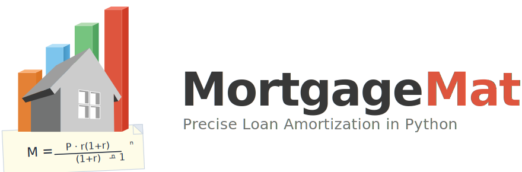

{width="40%" fig-align="center"}

```{python}
#| echo: false
#| output: asis
import mortgagemath
print(f"Library version: **{mortgagemath.__version__}** · Rendered "
      f"by Quarto.")
```

`mortgagemath` is a stdlib-only Python library that produces
amortization schedules reproducing published lender, regulator, and
textbook examples to the cent. Decimal end-to-end, configurable
rounding, balance-tracking, day-count, compounding, and payment
cadence; full ARM support (rate changes, optional recast, optional
payment caps with negative amortization).

## Vignettes

| Vignette | Audience | Length |
|---|---|---|
| [Library at a glance](at-a-glance.qmd) | Evaluating fit in 60 seconds | 1 page |
| [Validation against published sources](validation.qmd) | Audit / risk review | 2 pages |
| [Reg Z Sample H-14 ARM walkthrough](arm-regz-h14.qmd) | ARM compliance reviewer | 2 pages |
| [Payment caps + negative amortization](payment-caps-proeducate.qmd) | ARM / accounting analyst | 2 pages |
| [Canadian semi-annual (j_2) mortgages](canadian-j2.qmd) | Canadian / cross-border | 1 page |
| [A short history of the level-payment mortgage](history.qmd) | Historical / academic context | 6 pages |

Each vignette is also available as a PDF (built deterministically
from the same source).

## Source

Repository: [github.com/murraystokely/mortgagemath](https://github.com/murraystokely/mortgagemath)
· PyPI: [`mortgagemath`](https://pypi.org/project/mortgagemath/)
· Vignettes licensed CC-BY-4.0; library code MIT.
